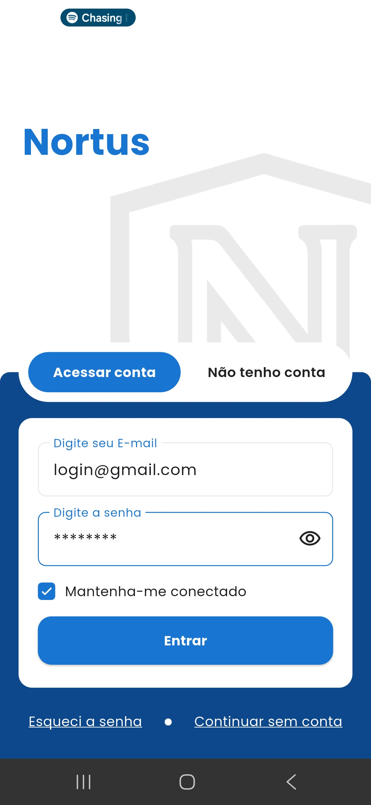
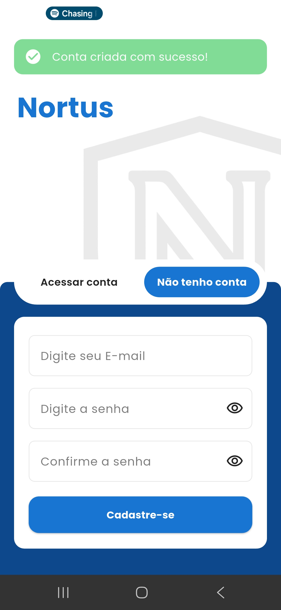
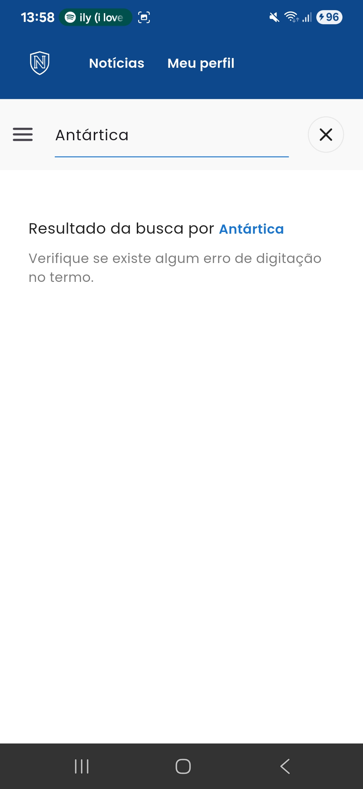
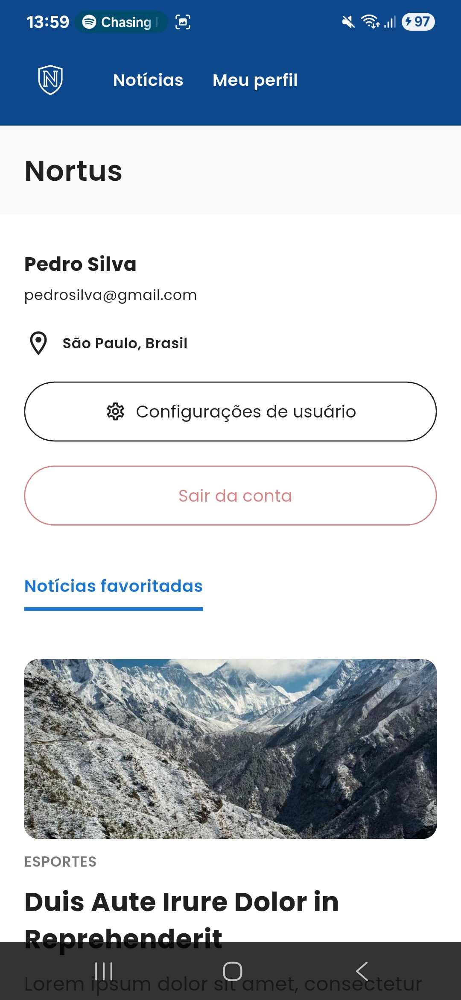
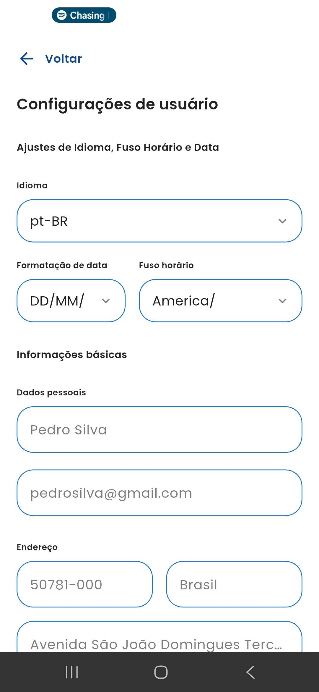

# 📱 Flutter News App — Loomi Challenge

## Introdução

Este projeto foi desenvolvido como parte do **Flutter Challenge da Loomi**, com o objetivo de demonstrar arquitetura, qualidade de código, gerenciamento de estado, integração de API e tomada de decisões sob restrições de tempo.
O aplicativo **Nortus News** permite que os usuários se autentiquem, naveguem por um feed de notícias paginado, pesquisem localmente, visualizem detalhes, gerenciem favoritos e atualizem seus perfis.

## Arquitetura
O projeto segue uma arquitetura limpa (Clean Architecture) adaptada ao contexto mobile, organizada de forma modular e baseada na separação clara de responsabilidades. O objetivo é obter um código escalável, fácil de testar, manter e evoluir.
A arquitetura é composta por três camadas principais:

#### 🔶 Domain (Regra de negócio)
Camada mais interna, totalmente independente de frameworks:
- Entidades
- Usecases
- Repositores (interfaces)
- Exceptions

#### 🔶 Data (Implementação)
Responsável por fornecer dados para o domínio:
- Repositories (implementação)
- Datasources (remotos e locais)
- Client HTTP
- Injeção de dependências

#### 🔶 Presentation (UI + State Managment)
A camada responsável pela interface do usuário e interação:
- BLoCs para controle de estado
- Notifiers
- Pages
- Widgets
- Rotas
- Temas e estilos

#### Fluxo de dados
Com essa arquitetura o aplicativo possui o fluxo de dados seguindo a cadeia:

Bloc ↔ Usecases ↔ Repositories ↔ Datasources ↔ API


## Fluxos implementados
#### Autenticação
- [x] Login com validação de formulários
- [x] Manter-se conectado via shared_preferences
- [x] Autenticação simulada via API mockada
#### Lista de notícias
- [x] Rolagem infinita com paginação via API
- [x] Exibição de título, image e resumo
- [x] Busca de notícias local por texto
#### Detalhes da notícia
- [x] Exibição de conteúdo completo obtido da API
- [x] Notícias relacionadas ao final da página
#### Favoritos
- [x] Persistência em memória durante build
#### Perfil
- [x] Obtido dados do usuário da API
- [x] Campos preenchidos previamente com dados do usuário
- [x] Simulação de atualização perfil
#### Feedback & UI
- [x] Snackbars para sucesso e erro
- [x] Indicadores de carregamento para todas as requisições
- [x] Responsividade básica

## Screenshots
<p align="left">
  
  
  
  
</p>
<p align="left">
  
  
  
  
</p>

## Pontos para melhoria futura
- Adicionar cobertura de testes para Repositories, Datasources e Usecases;
- Adicionar suporte à offline, utilizando informações em cache;
- Otimizar carregamento de imagens;

## Tecnologias utilizadas
- Dio;
- Bloc;
- Provider;
- GoRouter;
- GetIt;
- Shared Preferences;

## Como executar o projeto

1. **Clone o repositório**
```bash
git clone https://github.com/devRenata/nortus-flutter-challenge.git
cd nortus-flutter-challenge
```

2. **Instale as dependências**
```bash
flutter pub get
```

3. **Execute o aplicativo**
```bash
flutter run
```
